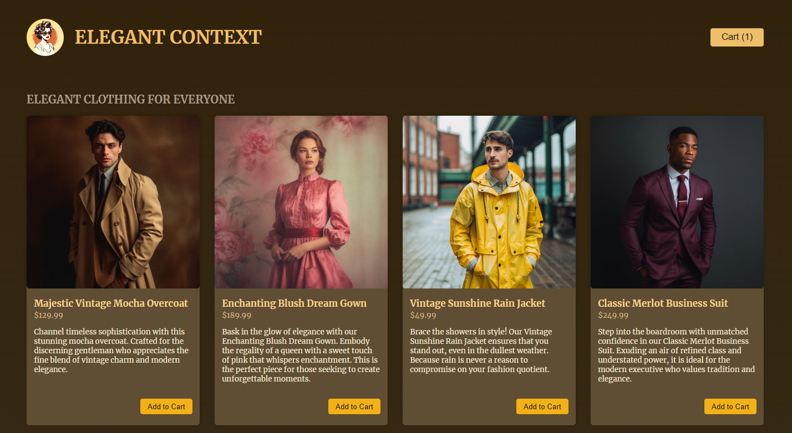
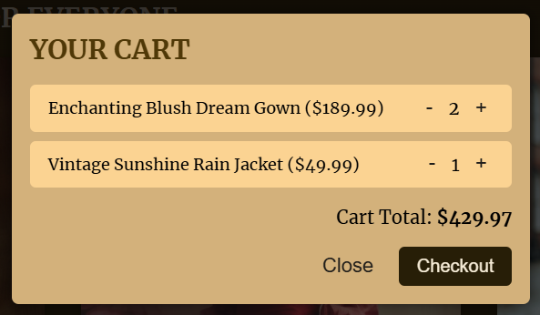

# Clothes shop React

"This is a small project developed with React, allowing users to select clothes and add them to their cart. Users can then open the cart modal to proceed to checkout.

## Table of contents

- [Overview](#overview)
  - [Screenshot](#screenshot)
- [My process](#my-process)
  - [Built with](#built-with)
  - [What I learned](#what-i-learned)
  - [Continued development](#continued-development)
  - [Useful resources](#useful-resources)
- [Author](#author)
- [Acknowledgments](#acknowledgments)

## Overview

### Screenshot





## My process

### Built with

- React
- CSS custom properties
- CSS Flex box

### What I learned

"While working on this project, I learned how to build the frontend based on a dummy JSON file, which provided the store products. I utilized advanced React hooks such as forwardRef, useImperativeHandle, and useRef to manage component references and states more efficiently. Additionally, I implemented useContext to handle global state management, ensuring seamless communication across components.

```js
<Shop>
  {DUMMY_PRODUCTS.map((product) => (
    <li key={product.id}>
      <Product {...product} />
    </li>
  ))}
</Shop>
```

```js
const CartModal = forwardRef(function Modal({ title, actions }, ref) {
  const dialog = useRef();

  useImperativeHandle(ref, () => {
    return {
      open: () => {
        dialog.current.showModal();
      },
    };
  });

  return createPortal(
    <dialog id="modal" ref={dialog}>
      <h2>{title}</h2>
      <Cart />
      <form method="dialog" id="modal-actions">
        {actions}
      </form>
    </dialog>,
    document.getElementById("modal")
  );
});
```

### Continued development

My goal is to further enhance my understanding of React hooks and custom hooks as I develop the app and ensure seamless integration with the backend.

### Useful resources

- [Example resource 1](https://www.udemy.com) - I developed this small application through the course Dive in and learn React.js from scratch! by Maximilian Schwarzmüller - Udemy.

## Author

- Website - [Daniela Serrano](https://github.com/danielaser)

## Acknowledgments

As a junior developer, I found the Udemy course Dive in and Learn React.js from Scratch! by Maximilian Schwarzmüller to be incredibly valuable. It has helped me create cleaner React applications and gain a better understanding of key concepts.
